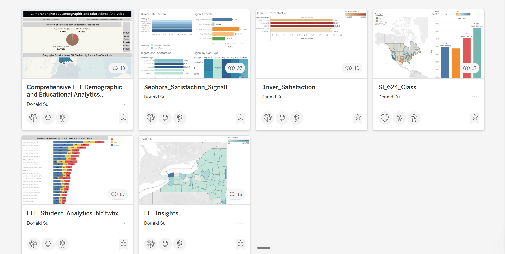
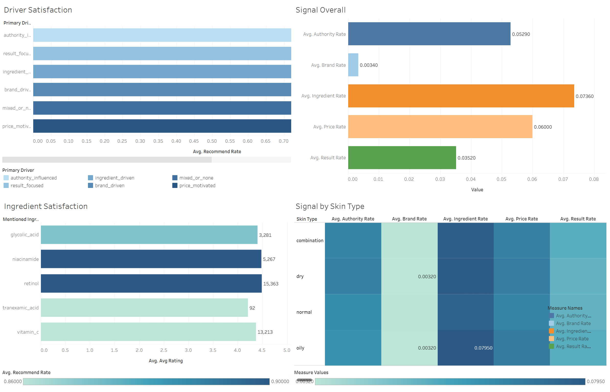
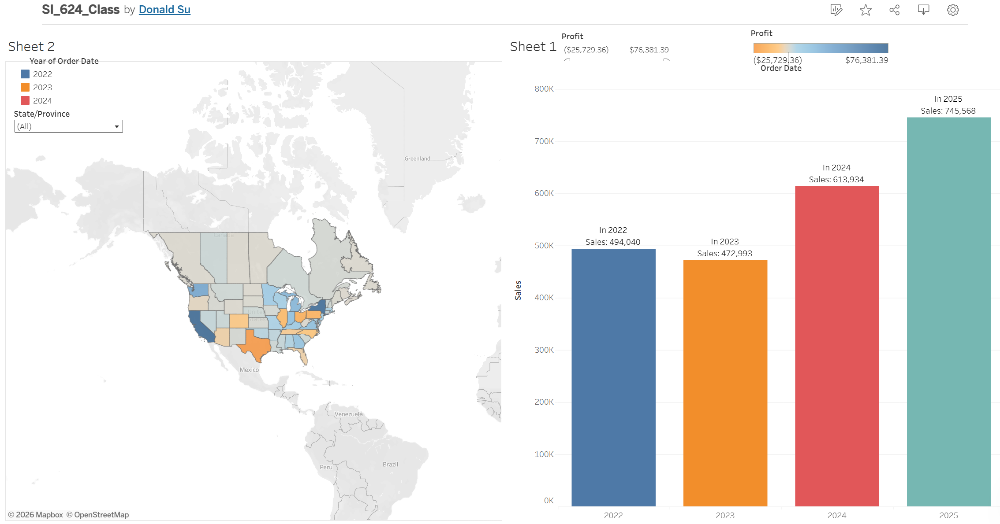

# 📊 Tableau Data Visualization Portfolio

> A gallery of interactive dashboards built in **Tableau** — spanning consumer/beauty analytics, education demographics, and sales performance.
> **Click any preview image to open the live, interactive dashboard on Tableau Public.**

**Author:** Donald Su · [Tableau Public profile](https://public.tableau.com/app/profile/donald.su4060/vizzes)

  

> ℹ️ **Setup:** replace every `YOUR_*_LINK` below with the dashboard's **Share → Copy Link** URL from Tableau Public.

---

## 📁 Contents

- [💄 Beauty & Consumer Analytics — Sephora Satisfaction Signals](#-beauty--consumer-analytics)
- [🎓 Education & Public Data](#-education--public-data)
  - [Comprehensive ELL Demographic & Educational Analytics](#comprehensive-ell-demographic--educational-analytics)
  - [Student Enrollment by Grade Level & School District](#student-enrollment-by-grade-level--school-district)
- [📈 Sales Performance — Regional Sales & Profit (SI 624)](#-sales-performance)

---

## 💄 Beauty & Consumer Analytics

### Sephora Satisfaction Signals

A four-panel dashboard decomposing **what actually drives satisfaction** in skincare reviews — built from the Sephora reviews dataset.

- **Ingredient beats brand, decisively.** Among the overall signals, *ingredient* carries the highest weight (**0.0736**) while *brand* is the weakest (**0.0034**) — i.e., what's *in* the product moves satisfaction far more than the label on it.
- **Retinol and vitamin C dominate the conversation.** By mention volume: retinol **15,363**, vitamin C **13,213**, niacinamide **5,267**, glycolic acid **3,281**, tranexamic acid just **92** — all averaging ~4.2–4.5★.
- **Skin type shifts the signal.** The heatmap shows *oily* skin reviews weight the ingredient signal highest (**0.0795**), useful for targeting messaging by segment.
- **Recommend rate is high across all buyer types** (~0.70), so the *driver mix*, not the recommend rate alone, is where the differentiation lives.

> **Business angle:** prioritize ingredient-led positioning over brand-led copy, lead with retinol / vitamin C, and tailor the pitch by skin type.
>
> 🔗 Related analysis pipeline: [Skincare Ingredient Sentiment Analysis](https://github.com/DonaldJasper0621) <!-- TODO: link your NLP repo -->

---

## 🎓 Education & Public Data

### Comprehensive ELL Demographic & Educational Analytics

A single-pane overview of English Language Learner (ELL) demographics across **100 schools / 32,770 enrolled students** in New York State.

- Race mix is heavily **Hispanic (80.79%)**, with White (1.26%) and American Indian (0.53%) small minorities.
- School-wise small multiples break each district down by Hispanic / Asian / Black American / White counts, and a NY State map shows geographic concentration.
- **Skills:** KPI tiles, pie + small-multiple bars + filled map combined in one layout, demographic ratio calculations.

### Student Enrollment by Grade Level & School District

Enrollment by **grade band** (Elementary / Middle / High) across NYC geographic and NY State districts, sorted so the largest districts surface first (e.g., NYC Geog Dist #24 – Queens leads with 7,284 elementary students).

- **Skills:** sorted stacked bars, grade-band color encoding, district-level aggregation, dense-label management.

---

## 📈 Sales Performance

### Regional Sales & Profit (SI 624)

Course project (SI 624) pairing a **profit choropleth** of North American states/provinces with **year-over-year sales** bars.

- Sales dipped slightly in 2023 (494K → 473K) then grew strongly: **614K in 2024** and **746K in 2025** — a clear upward trajectory.
- Profit is color-encoded on the map (range −$25.7K to +$76.4K), surfacing high- and low-margin regions at a glance.
- **Skills:** linked geographic + temporal views, diverging profit color scale, YoY comparison, interactive State/Province + Year filters.

---

## 🧰 Tools & Skills

`Tableau Desktop` · `Tableau Public` · calculated fields · dashboard actions & filters · choropleth / filled maps · KPI design · aspect-based segmentation · small multiples

## 📝 Notes

- All dashboards are published to **Tableau Public** and are fully interactive at the linked URLs.
- Preview images are static exports; filters, tooltips, and highlight actions are available in the live versions.
- Datasets are public / de-identified; coursework dashboards use class-provided or open data.

---

**Maintainer:** Donald Su · Feedback welcome!
